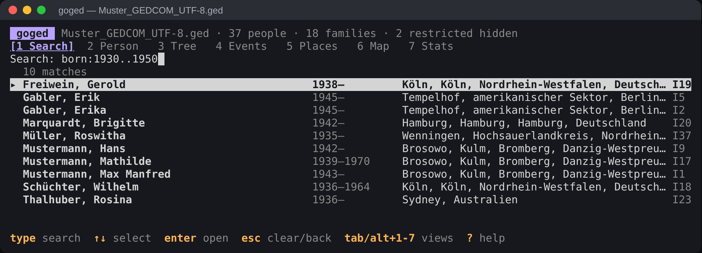
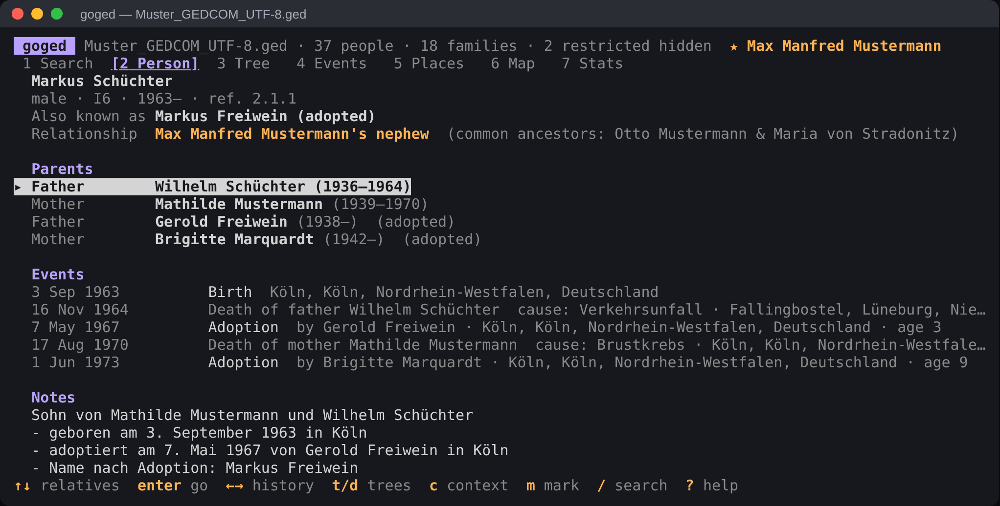
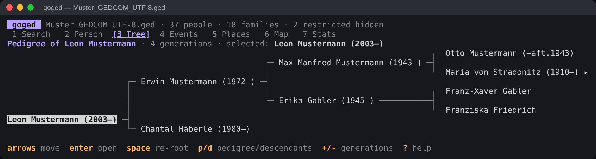
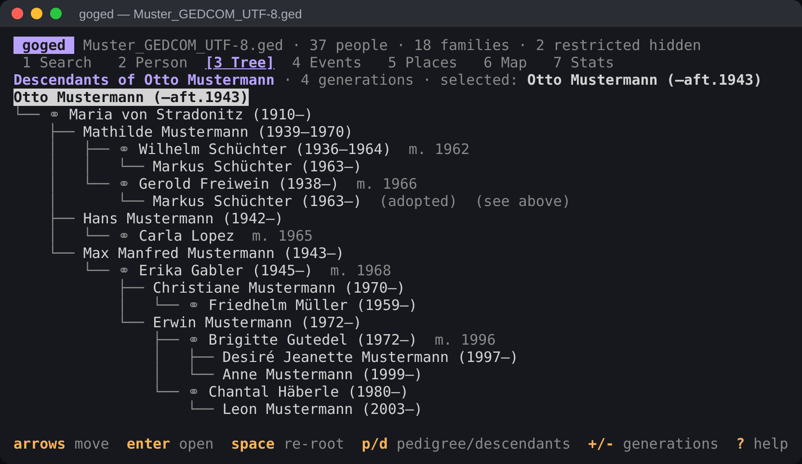
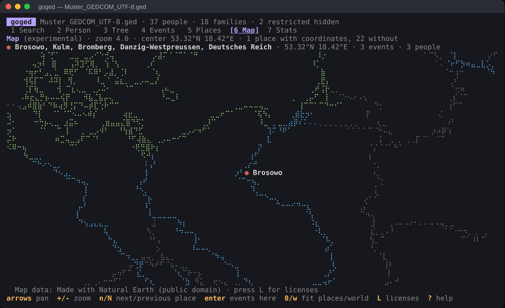

# goged

A fast terminal browser for [GEDCOM](https://gedcom.io/) genealogy files.
Search people by name and any other property, read their life events in
order, jump between relatives, and explore pedigree and descendant trees —
all from the keyboard.

The screenshots below use the [GEDCOM-L sample file](testdata/Muster_GEDCOM_UTF-8.ged).

\
*Search with a year range; results show lifespans and birth places.*

\
*Person view with the relationship to a marked reference person, and birth and adoptive parents.*

\
*Pedigree chart of ancestors.*

\
*Descendant chart with spouses, marriage years and an adopted child.*

\
*The experimental map shows places that have coordinates.*

## Features

- **Search as you type** over names (diacritic-insensitive, alternate and
  married names included, phonetic matching) and over any other
  property: dates, places, occupations, notes, sources, arbitrary GEDCOM tags.
- **Person view** with parents, siblings and half-siblings, every family with
  spouse and children, associated people (godparents, witnesses, friends:
  `ASSO`, `_ASSO`) and records that may describe the same person (`ALIA`),
  notes and sources with quoted text. All relatives are links: move the
  cursor and press enter to jump; go back and forward like in a web browser.
- **Life timeline** of important events in chronological order, with the
  person's age at each event, optionally interleaved with the births,
  marriages and deaths of close relatives during their lifetime.
- **Tree views**: a horizontal pedigree chart of ancestors and an indented
  descendant chart with spouses, both navigable with the arrow keys,
  re-rootable, and adjustable from 2 to 12 (pedigree) or 20 (descendants)
  generations.
- **Events browser** listing all (or only the vital) events of the file in
  chronological order, with a filter for type, year range, place and names.
- **Places browser**: every place in the file arranged by jurisdiction
  (country → county → town) with the number of events and people, collapsible
  and filterable. Select a place to list everything that happened there and in
  the places within it, then open the people involved.
- **Map (experimental)**: a zoomable world map drawn with Braille characters,
  with coastlines, country borders, rivers and lakes, and a marker for every
  place that has coordinates (`PLAC` → `MAP` → `LATI`/`LONG`, or the place
  record the place refers to). The map data is
  compiled into the executable, so goged stays a single file.
- **Relationship calculator**: mark a reference person and every person view
  tells how they are related ("Harold Smith's third cousin", "half-great-aunt",
  "brother-in-law", "husband's aunt", "co-father-in-law", "adoptive father"),
  including the closest common ancestors. Blood relationships follow birth
  links only; adoptive, foster and step links are named as such.
- **Statistics and validation**: counts, time span, generations, lifespans,
  most common names, the events that happened on this day in earlier years,
  and all warnings found while reading the file.
- **Privacy**: data marked confidential or private (`RESN`) is hidden unless
  you ask for it.
- **Batch mode** for scripts: print search results, charts, timelines,
  relationships, events and statistics without starting the interface.

### Robust GEDCOM support

- GEDCOM 5.5, 5.5.1 and 7.0, read leniently: malformed lines, level jumps,
  links recorded on only one side and similar defects are repaired where
  possible and reported as warnings instead of aborting.
- Character sets: UTF-8 (with or without BOM), UTF-16 LE/BE, ANSEL (including
  combining diacritics), Windows-1252, ISO-8859-1, IBM PC (CP437/850) and
  MacRoman, detected from the byte order mark and the `CHAR` header.
- The full date grammar: `ABT`, `CAL`, `EST`, `BEF`, `AFT`, `BET … AND …`,
  `FROM … TO …`, `INT … (phrase)`, dual years such as `1750/51`, B.C. dates,
  and the Gregorian, Julian, Hebrew and French Republican calendars, converted
  to a common timeline for sorting and age calculation. Common deviations such
  as full month names, `Abt.`, `circa` or ISO dates are accepted too.
- `CONT`/`CONC` continuation lines, shared notes (`NOTE`/`SNOTE` records),
  place records (`_LOC`, as agreed by GEDCOM-L: places written differently
  but referring to the same record are grouped, and their coordinates, other
  names and GOV identifiers are used), source citations, adoption and
  fostering (`PEDI`, per parent through
  `ADOP`.`FAMC`.`ADOP` or `_FREL`/`_MREL`) and custom `_TAGS`; any custom tag
  with a date or place is treated as an event.

## Installation

Download a ready-made binary from the
[releases page](https://github.com/efi/goged/releases): one universal binary
for macOS (Intel and Apple Silicon) and binaries for Linux and Windows on
x86-64 and ARM64. File names carry the build date, e.g.
`goged-2026-10-08-linux-amd64`. On macOS and Linux run `chmod +x` on the file
first; macOS may also ask you to allow the unsigned binary
(`xattr -d com.apple.quarantine goged-*-macos-universal`).

To build from source you need Go 1.24 or later:

```sh
go install github.com/efi/goged@latest
```

or from a checkout:

```sh
go build -o goged .
```

## Usage

```sh
goged family.ged                 # open the browser
goged -person I42 family.ged     # open the browser at a person
cat family.ged | goged -         # read from standard input
```

Data marked confidential or private (`RESN confidential` or `privacy`) is
hidden: restricted events and structures are left out, and of restricted
people and families only names and family links remain. The header and
`-stats` say how much was withheld; `-show-restricted` shows everything.

Batch mode prints to standard output and exits:

```sh
goged -q 'surname:jones born:<1850' family.ged
goged -tree I20 -gen 5 family.ged          # pedigree chart (ancestors)
goged -desc I1 -ascii family.ged           # descendant chart, ASCII lines
goged -timeline I14 family.ged             # life events incl. relatives
goged -relate I20,I23 family.ged           # how is I23 related to I20?
goged -events 'type:marr place:leeds' family.ged
goged -events '' -all family.ged           # every event, chronologically
goged -places family.ged                   # place hierarchy with counts
goged -stats family.ged                    # statistics and warnings
goged -licenses                            # licenses of map data and libraries
```

```
$ goged -relate I20,I23 testdata/family.ged
Dorothy Jones is Harold Smith's third cousin.
Closest common ancestors: William Smith & Elizabeth Brown (4 and 4 generations up).

$ goged -tree I14 -gen 3 testdata/family.ged
                                                       ┌─ John Smith (1817–1880) ▸
                          ┌─ Thomas Smith (1842–1910) ─┤
                          │                            └─ Ann Taylor (1820–1845)
Arthur Smith (1866–1940) ─┤
                          └─ Jane Doe (1844–)

$ goged -desc I3 -gen 3 testdata/family.ged
John Smith (1817–1880)
├── ⚭ Ann Taylor (1820–1845)  m. 1840
│   └── Thomas Smith (1842–1910)
│       └── ⚭ Jane Doe (1844–)  m. 1865
│           └── Arthur Smith (1866–1940) ▾
└── ⚭ Sarah White (1825–1890)  m. 1847
    ├── Emma Smith (1848–)
    │   └── ⚭ Friedrich Müller (1845–)  m. 1870
    │       └── Edith Miller (1872–)
    └── George Smith (1850–1851)
```

`▸` and `▾` mark people with more ancestors or descendants beyond the
generation limit.

Try it with the sample file in [`testdata/family.ged`](testdata/family.ged).

## Keys

| Where   | Keys | Action |
|---------|------|--------|
| Global  | `/` | search |
|         | `tab` / `shift+tab`, `1`…`7` (`alt+1`…`alt+7` while typing) | switch view: search, person, tree, events, places, map, stats |
|         | `b`, `backspace`, `[` / `]` | back / forward in history |
|         | `m` | mark the current person as reference for relationships (again to clear) |
|         | `?` | help · `L` licenses · `q`, `ctrl+c` quit |
| Search  | type, `↑` `↓` `pgup` `pgdown`, `enter`, `esc` | search, select, open, clear / return |
| Person  | `↑` `↓` (`j` `k`), `enter` | move between relatives, go to relative |
|         | `←` `→` (`h` `l`) | back / forward |
|         | `t` / `d` | pedigree / descendant tree of this person |
|         | `c` | show or hide relatives' events in the timeline |
| Tree    | arrows (`h` `j` `k` `l`) | move: `←` towards the root, `→` away from it |
|         | `enter` / `space` | open person / make them the root |
|         | `p` `d` `v`, `+` `-` | pedigree, descendants, toggle; more or fewer generations |
| Events  | `f`, `a`, `x`, `enter` | edit filter, all/important events, clear filter, open person |
| Places  | `←` `→` (`h` `l`), `-` / `+` | collapse/expand a place (or go to the enclosing/first contained place); collapse/expand all |
|         | `enter`, `esc` | list the events at a place and within it (enter again opens the person); back to the places |
|         | `f`, `x`, `M` | filter places by name, clear the filter, show the place on the map |
| Map     | arrows (`h` `j` `k` `l`), `+` `-` | pan, zoom |
|         | `n` / `N`, `enter` | next/previous place (most events first), list the events at the place |
|         | `0`, `w`, `c` | fit all places, whole world, center on the selected place |
| Stats   | `enter` | list everybody with the selected surname |

## Search syntax

All terms must match. Text without a field matches names: every word of a
name is compared by prefix, so `jo smi` finds John Smith; diacritics and case
are ignored (`muller` finds Müller).

| Query | Matches |
|-------|---------|
| `smith`, `"van der berg"` | name words starting with *smith*; an exact phrase |
| `~smyth` | names that sound alike (Soundex and the Cologne phonetics for German names agree): Smith, Smyth, Schmidt |
| `given:john`, `surname:smith` | one part of the name (also `first:`, `last:`, `name:`) |
| `born:1850`, `died:1900` | year of birth / death; baptism and burial count when there is no birth or death date |
| `born:1840..1860`, `born:<1900`, `born:>=1850`, `born:~1850`, `born:1850s` | year ranges (`~` = ±5 years) |
| `born:leeds`, `died:york` | place of birth / death |
| `place:york`, `year:1881` | any event at a place / in a year (dates before or after a year count for that year only) |
| `alive:1900` | possibly alive in that year |
| `sex:f` | `m`, `f`, `u` (unknown) or `x` |
| `id:I12` or just `I12` | a record identifier |
| `occupation:weaver`, `note:mill`, `source:census`, `any:text` | occupations, notes, cited sources, any value |
| `has:parents` | `birth death parents father mother spouse children siblings notes sources media occupation` |
| `tag:_MILT`, `tag:BIRT.PLAC=leeds` | a tag (path) exists, optionally with a value |
| `-term` | exclude: `smith -given:john`, `-has:parents` |
| `1850` | a bare year matches the year of birth or death |

Approximate dates match generously: `ABT 1850` matches 1848–1852, `BEF 1850`
matches 1840–1850.

The events filter understands `type:marr,div` (tags or names such as
`birth`, `marriage`, `census`), year ranges (`1850..1870` or `year:`),
`place:`, `name:`, negation and plain text.

## The map (experimental)

Coordinates are read from the standard GEDCOM structure below a place:

```
2 PLAC TheSpecificPlace
3 MAP
4 LATI N50.781464
4 LONG E10.786089
```

Signed decimals (`-0.1278`), a trailing hemisphere letter (`50.78N`) and a
decimal comma are accepted as well. A place gets the coordinates of the first
event that records them.

The map shows the 1:10m coastlines, land borders, rivers and lakes of
[Natural Earth](https://www.naturalearthdata.com/), simplified to about
0.005° and stored in a compact format (`worldmap/world.bin`, 1.5 MB) that is
embedded into the executable. Minor rivers and lakes appear as you zoom in.
To rebuild the data from the Natural Earth GeoJSON files:

```sh
go run ./worldmap/mkworld -o worldmap/world.bin \
    -coast ne_10m_coastline.geojson \
    -borders ne_10m_admin_0_boundary_lines_land.geojson \
    -rivers ne_10m_rivers_lake_centerlines.geojson \
    -lakes ne_10m_lakes.geojson
```

## Licenses

Natural Earth map data is in the public domain; goged credits it with "Made
with Natural Earth". The licenses of the map data and of all libraries
compiled into goged can be read in the program (`L`) or printed with
`goged -licenses`. After changing dependencies, regenerate the embedded
license texts with `scripts/gen-licenses.sh`.

## Development

```sh
go test ./...                       # unit, golden and interface tests
go test -race -cover ./...
go test -fuzz FuzzParse ./gedcom    # fuzz the parser (also FuzzParseDate, FuzzParseLine)
go test -fuzz FuzzParse ./search    # fuzz the query language
go test -bench . ./search
```

Releases are built by the **Release** workflow: open *Actions → Release →
Run workflow* on GitHub. It runs the tests, builds all binaries with
[`scripts/build-release.sh`](scripts/build-release.sh) (which also works
locally and writes to `dist/`) and publishes them as a release tagged with the
build date; a second run on the same day replaces that day's release.

| Package | Contents |
|---------|----------|
| [`gedcom`](gedcom) | line parser, character set detection and ANSEL decoding, node tree, typed model (individuals, families, events, names, places, sources, notes), dates and calendars |
| [`genealogy`](genealogy) | relationship calculator, life timelines, place hierarchy, statistics |
| [`search`](search) | query language, diacritic folding, Soundex and Cologne phonetics, person index, event filter |
| [`chart`](chart) | pedigree and descendant charts with node positions for navigation |
| [`worldmap`](worldmap) | embedded Natural Earth map data, Web Mercator projection and Braille renderer; [`mkworld`](worldmap/mkworld) converts GeoJSON |
| [`licenses`](licenses) | embedded third-party license texts |
| [`tui`](tui) | the Bubble Tea interface |
| [`main.go`](main.go) | command-line entry point and batch mode |

The interface is built with [Bubble Tea](https://github.com/charmbracelet/bubbletea),
[Bubbles](https://github.com/charmbracelet/bubbles) and
[Lip Gloss](https://github.com/charmbracelet/lipgloss).
